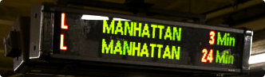

# ascii-art

Created by [@theoludwig](https://github.com/theoludwig) on 1 May 2022.

## Instructions

### Goal

In stations and airports you often see this type of screen:



Have you ever asked yourself how it might be possible to simulate this display on a good old terminal? We have: with ASCII art!

### Rules

ASCII art allows you to represent forms by using characters. To be precise, in our case, these forms are words. For example, the word "MANHATTAN" could be displayed as follows in ASCII art:

```txt
# #  #  ### # #  #  ### ###  #  ###
### # # # # # # # #  #   #  # # # #
### ### # # ### ###  #   #  ### # #
# # # # # # # # # #  #   #  # # # #
# # # # # # # # # #  #   #  # # # #
```

​Your mission is to write a program that can display a line of text in ASCII art in a style you are given as input.

### Input

- **Line 1:** The width `W` of a letter represented in ASCII art. All letters are the same width.
- **Line 2:** The height `H` of a letter represented in ASCII art. All letters are the same height.
- **Line 3:** The line of text `T`, composed of `N` ASCII characters.
- **Following lines:** the string of characters `ABCDEFGHIJKLMNOPQRSTUVWXYZ?` Represented in ASCII art.

### Output

The text `T` in ASCII art.

The characters a to z are shown in ASCII art by their equivalent in upper case.

The characters that are not in the intervals `[a-z]` or `[A-Z]` will be shown as a question mark in ASCII art.

### Constraints

- $$0 < W < 30$$
- $$0 < H < 30$$
- $$0 < N < 200$$

## Source

[CodinGame](https://www.codingame.com/training/easy/ascii-art)

## Examples

See the `test` folder for examples of input/output.
