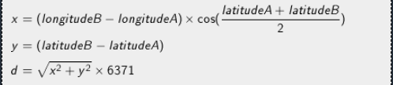

# defibrillators

Created by [@Divlo](https://github.com/Divlo) on 28 June 2021.

## Instructions

### Goal

The city of Montpellier has equipped its streets with defibrillators to help save victims of cardiac arrests. The data corresponding to [the position of all defibrillators](http://data.montpellier3m.fr/dataset/d%C3%A9fibrillateurs-de-montpellier) is available online.

Based on the data we provide in the tests, write a program that will allow users to find the defibrillator nearest to their location using their mobile phone.

### Rules

The input data you require for your program is provided in text format.
This data is comprised of lines, each of which represents a defibrillator. Each defibrillator is represented by the following fields:

- A number identifying the defibrillator
- Name
- Address
- Contact Phone number
- Longitude (degrees)
- Latitude (degrees)
These fields are separated by a semicolon (`;`).

**Beware:** the decimal numbers use the comma (,) as decimal separator. Remember to turn the comma (,) into dot (.) if necessary in order to use the data in your program.

### Distance

The distance `d` between two points `A` and `B` will be calculated using the following formula:

**Note:** In this formula, the latitudes and longitudes are expressed in radians. 6371 corresponds to the radius of the earth in km.

The program will display the name of the defibrillator located the closest to the user’s position. This position is given as input to the program.

### Input

- **Line 1:** User's longitude (in degrees)
- **Line 2:** User's latitude (in degrees)
- **Line 3:** The number `N` of defibrillators located in the streets of Montpellier
- **`N` next lines:** a description of each defibrillator

### Output

The name of the defibrillator located the closest to the user’s position.

### Constraints

- 0 < `N` < 10 000

## Source

- [CodinGame](https://www.codingame.com/ide/puzzle/defibrillators)

## Examples

See the `test` folder for examples of input/output.
